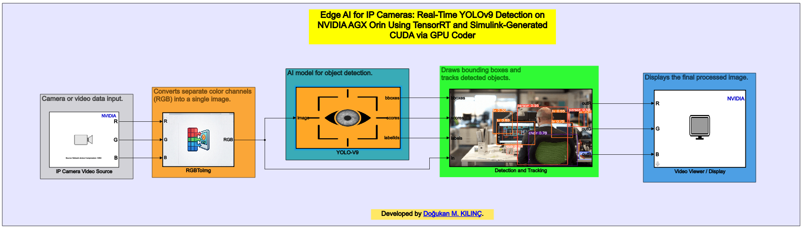
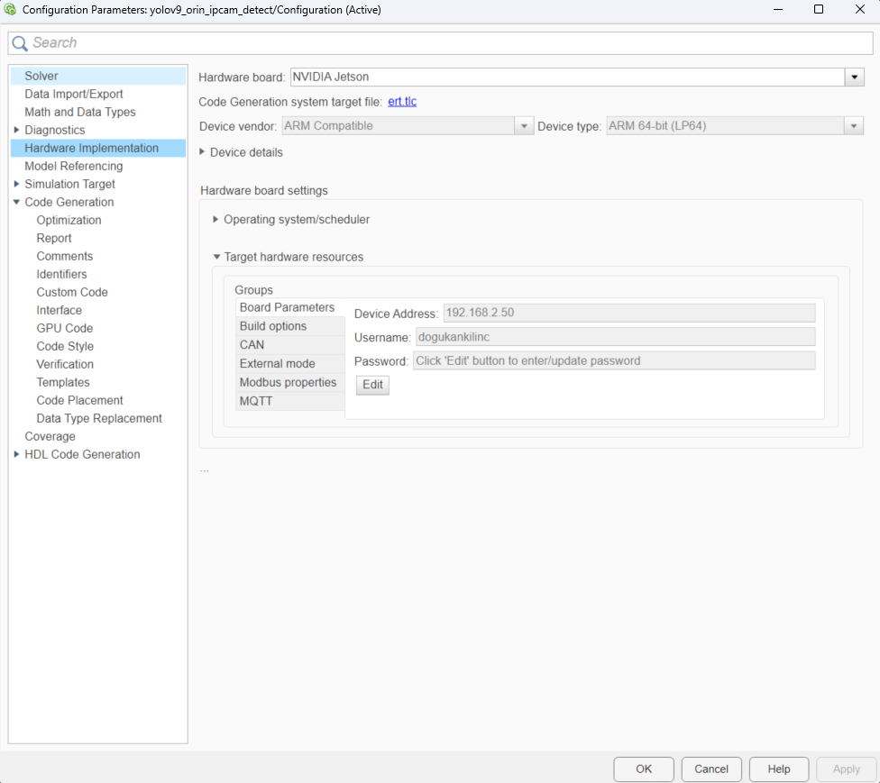
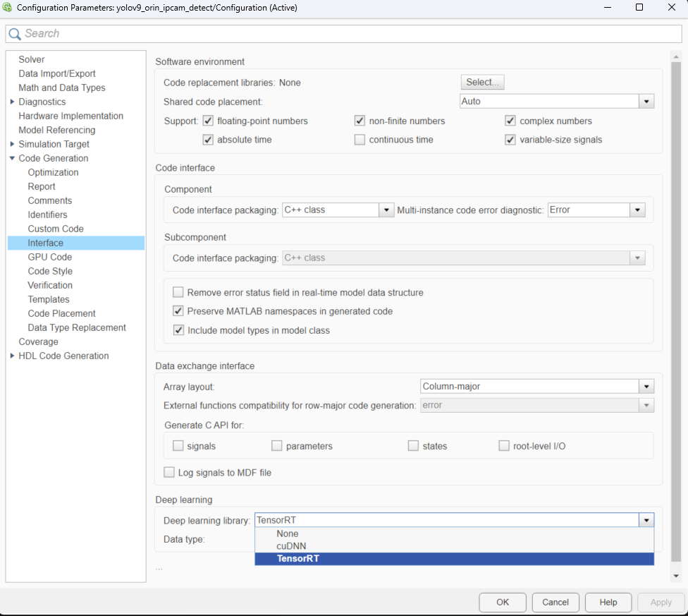
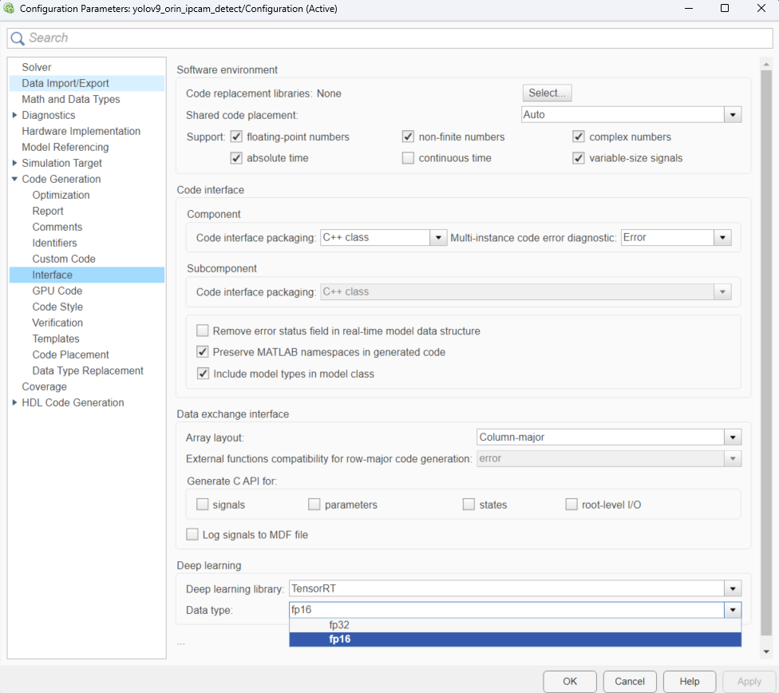

# Deploy Real-Time YOLOv9 Object Detection on NVIDIA Jetson AGX Orin using Simulink

This example shows how to deploy a Simulink® model on the NVIDIA® Jetson AGX Orin™ board for real-time object detection using an IP camera stream. This example detects and tracks objects in real-time by using the advanced YOLOv9 deep learning network. 

The Simulink model uses the network stream input and display blocks from the MATLAB® Coder™ Support Package for NVIDIA Jetson and NVIDIA DRIVE™ Platforms to capture the live video stream from an IP camera, process it using TensorRT™ optimized CUDA® code, and display the bounding boxes and prediction results on a monitor connected to the Jetson platform.

---

## Prerequisites

**Target Board Requirements**
* NVIDIA Jetson AGX Orin embedded platform.
* Ethernet cable to connect the target board and host PC (or network connection for the IP camera).
* An IP Camera accessible over the network (RTSP/HTTP stream).
* A monitor connected to the display port of the target.
* GStreamer libraries on the target for IP stream decoding.
* NVIDIA CUDA® toolkit and driver on the target.
* NVIDIA cuDNN and TensorRT™ libraries on the target for high-performance inference.

**Development Host Requirements**
* Environment variables for the compilers and libraries set up in MATLAB.

---

## Model Architecture

The Simulink model is divided into highly optimized subsystems for edge deployment:



1. **NVIDIA Video Source:** Configured to receive an RTSP/HTTP video stream from an IP camera over the network.
2. **RGBToImg:** Converts the separate R, G, and B component outputs into a planar RGB image format.
3. **YOLO-V9 (Detection Model):** Takes the image frame and runs prediction using the YOLOv9 network, outputting bounding boxes, scores, and class labels.
4. **Detection and Tracking:** Calculates FPS, tracks objects, and annotates the input image.
5. **Video Viewer / Display:** Opens an SDL display window showing the final annotated video stream on the target monitor.

---

## Configure the Model for Deployment

To achieve real-time performance, the model is configured to generate highly optimized C++ CUDA code utilizing NVIDIA TensorRT and FP16 precision.

### 1. Hardware Implementation Settings
Configure the connection to your specific Jetson board:
* Open **Configuration Parameters > Hardware Implementation**.
* Enter the **Device Address**, **Username**, and **Password** of your Jetson AGX Orin.



### 2. Deep Learning Target Library
For high-performance, real-time object detection on the AGX Orin, the deep learning target is set to TensorRT.
* Navigate to **Code Generation > Interface > Deep learning**.
* Set the **Deep learning library** to `TensorRT`.



### 3. Precision Optimization (FP16)
To maximize inference speed and utilize the Tensor Cores on the Jetson AGX Orin, we use half-precision floating-point format.
* Set the **Data type** parameter to `fp16`.



## 4. Final Execution Output

After completing all deployment and configuration steps described above, the system runs on the Jetson AGX Orin and produces the following real-time output interface.
The processed video stream from the IP camera is displayed with YOLOv9 detections (bounding boxes, labels, and confidence scores) rendered directly on the Jetson device via an SDL-based window.
This is the final output observed on the Jetson desktop:


---

## Generate, Deploy, and Run

1. Open the **Hardware** tab on the Simulink Editor.
2. Click **Build, Deploy & Start**. 
   *(Note: The initial TensorRT engine building process may take several minutes. Subsequent builds will reuse the engine.)*
3. Once deployed, an SDL window will open on the monitor connected to the Jetson AGX Orin, displaying the IP camera feed with YOLOv9 bounding boxes, confidence scores, and real-time FPS.

To stop the running application from the MATLAB Command Window:

```matlab
stopModel(hwobj, 'yolov9_orin_ipcam_detect');
